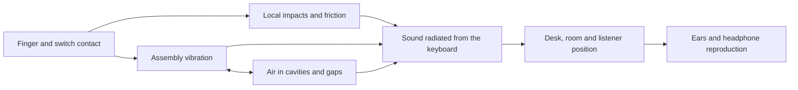

# Making Keyconf sound like a real keyboard

Research checked September 5, 2026. Prepared for Keyconf's builder, with headphone listening and the HD 800 S in mind.

## The decision

Build a library of recordings of complete, documented keyboards. Use those recordings for faithful playback. Develop measurement-calibrated physical models alongside that library to estimate configurations we have not recorded.

I found no ready-made library with demonstrated accuracy across arbitrary combinations of switches, keycaps, plates, cases, mounting systems, foam, and modifications. Existing typing apps mainly replay recordings. Recent research can reconstruct the impact sound of measured objects, but its results do not establish an acoustically exact keyboard configurator.

The first fidelity target should be **reproducing a particular recorded build from a particular listening position**. Reproducing how a physical keyboard sounds to a particular person at their desk is a larger problem involving the room, their ears, headphones, and playback level. Neither target can be guaranteed by a parts list alone.

The current app is still an illustrative synthesizer. Inspection of `lib/audio.ts` found random noise, a bandpass filter, and a falling sine tone. It has no recorded build, release samples, measured resonances, or spatial capture. `app/page.tsx` triggers demo audio through JavaScript timers. The interface correctly labels the result approximate. This research does not change that engine or claim a listening improvement.

## What the acoustic engine has to model

An impact renderer needs the force that excites an object, its vibration, and the resulting acoustic behavior. DiffImpact explicitly models these stages. Applying that framework to a keyboard means accounting for the switch and keycap impacts, the assembled plate/case response, and the path to the listener. This keyboard mapping is an engineering inference, not a published validation of our app. [DiffImpact, Clarke et al., CoRL 2021 / PMLR 2022](https://proceedings.mlr.press/v164/clarke22a.html).

This is a conceptual map, not a solved simulation. A reverb effect addresses only part of it.

Yes, software can simulate air inside a case. COMSOL's Acoustics Module couples pressure acoustics with structural mechanics and includes wave methods, porous-material formulations, and thermoviscous acoustics for small spaces. Its documentation also states that ray acoustics requires wavelengths much smaller than the relevant geometry. Our inference is that simply shrinking a room-raytracing scene into a keyboard is not a reliable cavity model. Use wave-based analysis where needed, with measured geometry and material properties. [COMSOL Acoustics Module](https://www.comsol.com/acoustics-module), [ray-acoustics validity](https://doc.comsol.com/6.3/doc/com.comsol.help.aco/aco_ug_geometrical_aco.11.02.html).

Our Blender meshes describe appearance. They do not specify manufacturing tolerances, joints, screw preload, gasket compression, damping, or measured material properties. They are insufficient input for a validated acoustic model.

## The strongest relevant engines and research

| Candidate | What is supported | Decision for Keyconf |
|---|---|---|
| [AV-MSF, August 2026](https://arxiv.org/html/2608.05145v1) | Learns a position-dependent modal sound field from multiview images and sparse actual impact recordings. Reports stronger results than compared methods on ObjectFolder Real and RealImpact. | A promising recent research direction. The [official repository](https://github.com/ZisenShao/AV-MSF) currently says code is coming soon. Its object-impact benchmark does not validate keyboard part substitutions. |
| [DiffSound, SIGGRAPH 2024](https://hellojxt.github.io/DiffSound/) | Differentiable finite-element modal analysis and synthesis, including inference of physical properties, geometry, and contact position from sound. | An offline experiment candidate. The [repository](https://github.com/TechnetiumMan/DiffSound) has CUDA/meshing dependencies; no reuse license was found in the checked root/README. |
| [DiffImpact](https://github.com/samuel-clarke/diffimpact) | Differentiable impact rendering and fitting; MIT-licensed research implementation. | A practical starting point for a small measured-modal experiment. It remains research code without keyboard-specific validation. |
| [COMSOL](https://www.comsol.com/acoustics-module) | Coupled structural and acoustic simulation, including cavity and radiation problems. | Appropriate engineering software for investigating a few measured assemblies offline. Commercial software, not a browser SDK. No purchase or pricing estimate is implied. |
| [Bempp](https://bempp.com/) | Boundary-element acoustics and FEM/BEM coupling. [Bempp-cl](https://github.com/bempp/bempp-cl) is MIT-licensed. | An open component for radiation/scattering research. We would still have to supply mechanics, measurements, meshing, and coupling. |
| [Steam Audio](https://valvesoftware.github.io/steam-audio/doc/capi/index.html) | HRTFs, SOFA support, occlusion, reflections, propagation, and convolution. [Apache-2.0 source](https://github.com/ValveSoftware/steam-audio). | Useful for spatial/environmental playback of an existing source. Its documented scope does not provide vibrating keyboard or switch-contact synthesis. A web port would need evaluation. |

AV-MSF is the newest strong candidate found in this search, not a universal SOTA winner. Its assumptions include approximately modal behavior, and the paper documents failure cases. The reported 43.8 ms inference on an A5000 GPU is a research workload timing, not key-to-headphone latency. We should evaluate it offline if the implementation becomes available. [AV-MSF paper and supplement](https://arxiv.org/html/2608.05145v1).

The proposed production approach is to fit compact resonances and decay parameters offline, then render the fitted model in the browser. First prove that it predicts held-out keys on one assembled keyboard. Predicting a different plate or mounting system is a separate experiment requiring recordings of those changes.

## Existing sound libraries

| Source | What we can verify | Coverage and adoption limit |
|---|---|---|
| [Bucklespring](https://github.com/zevv/bucklespring) | The author recorded an IBM Model M; individual key presses/releases and spatial playback are central to the project. The inspected tree contains 209 WAV files. | The clearest established architectural reference for per-key playback. Inspected audio is mono 16-bit/44.1 kHz. The repository has GPL-2.0 terms; do not assume a permissive separate audio license. It represents a Model M, not our selected custom build. |
| [Mechvibes](https://github.com/hainguyents13/mechvibes/wiki/Config-Versions) | Maps keycodes to files or offsets in an audio file. Supports community packs. | Useful import-format reference. Pack quality, completeness, and rights need individual checking. The software's license is not a blanket grant for contributed recordings. |
| [MechvibesDX](https://github.com/hainguyents13/mechvibes-dx) | Current Rust/Dioxus successor with polyphonic playback, decoding/resampling on load, multiple formats, and classic-pack conversion. MIT code. | A better current implementation reference than treating the classic wiki's draft format as shipped functionality. Its audio still requires pack-level provenance. |
| [kbsim](https://github.com/tplai/kbsim) | Browser simulator; inspected assets include 151 MP3 files with press/release, row, and modifier groupings. | Useful interaction reference. MIT code does not establish recorder ownership or the full build provenance of every asset. No arbitrary-build accuracy validation found. |
| [Klack](https://tryklack.com/faqs) | Its FAQ says each set has over 100 individually recorded/mastered files. The product describes press/release and spatial behavior. | A commercial experience reference. No source-audio reuse grant found. Pitch variation can add variety, but is not evidence of physical fidelity. |
| [EPOMAKER Sound Lab](https://epomaker.com/pages/sound-lab) | Advertises a repeatable recording setup, 96 kHz/24-bit WAV masters, build logs, and CC BY-NC licensing. | The inspected page exposed nine MP3 files, but no verified WAV download or versioned license link. Treat master availability as unverified. Commercial reuse is not established. Peak normalization also prevents direct absolute-level comparison without calibration data. |
| [OpenGameArt keyboard sounds](https://opengameart.org/node/122745) | Creator-posted CC0 pack of a Cherry KC1000, recorded with an SM7B and processed with Neutron 2; 32 single keystrokes plus typing. | A useful explicitly licensed integration fixture. Coverage and processing do not meet our proposed reference-build capture standard. |
| [MKA v4 dataset, 2024](https://data.mendeley.com/datasets/bpt2hvf8n3/4) | CC BY 4.0 keyboard-classification data, including several laptop brands and conferencing transmission paths. | Research/test material, not a controlled custom-build comparison library. |
| [Keyboard dataset, July 2026](https://zenodo.org/records/19453177) | CC BY 4.0; inspected archive contains 114 mono 16-bit/48 kHz WAVs covering 38 keys and three pressure categories on one HP Victus scissor keyboard. | The [paper](https://www.mdpi.com/2306-5729/11/7/168) describes wireless-earbud capture and uncalibrated human pressure categories. It is not an audiophile sample bank or a matrix of custom builds. |

These are source and asset-structure checks, not headphone auditions or independent measurements of playback quality. No third-party sound pack was added to the public app.

[KeebSound](https://www.keebsound.com/) advertises a much larger catalog, but its [terms](https://www.keebsound.com/terms) reserve recording rights and prohibit automated harvesting without permission. A browsable comparison site is not necessarily an importable database or licensed sound API. [Click and Thock](https://www.clickandthock.com/) is a useful controlled-comparison reference; its stated method keeps other build and recording conditions fixed when comparing switches.

Taeha Types remains a valuable presentation and build reference. Obtain a creator agreement and original masters before using a creator's recordings as shipped assets. A public video or a site importer does not supply those rights. [Taeha Types](https://www.taehatypes.com/).

## The recording protocol I would build around

HEAD acoustics published a keyboard-specific measurement guide in 2017. It supports repeatable microphone or artificial-head capture, consistent distance and room conditions, reproducible striking, separate attention to large keys, and binaural listening assessment. It also explains why single-letter tests cannot represent full typing and discusses time-varying loudness and sharpness. That is a more relevant foundation than choosing clips by a label such as "thocky." [Analyzing keyboard noises, HEAD acoustics](https://cdn.head-acoustics.com/fileadmin/data/global/Application-Notes/SVP/Sound-Quality-Keyboard-Noise_e.pdf).

The following quantities are our proposed pilot design, not an established standard:

1. **Choose one complete reference assembly.** Record every component revision, plate thickness, mount, foam layers, keycap profile/thickness, switch batch, spring, lubricant, films, stabilizer tuning, and assembly notes. Photograph the assembled and opened build. Changing these produces a new recording revision.
2. **Capture two perspectives.** Use a fixed reference microphone for comparisons and a synchronized binaural perspective at a documented typist position. Keep raw captures. Archive 24-bit PCM at 48 or 96 kHz according to the capture hardware; choose the delivery rate after measuring the playback path. A higher file rate alone is not our quality criterion.
3. **Record every key.** Pilot three repeatable effort conditions and six takes per condition, with isolated presses and releases plus natural typing passages. Call the conditions light/medium/firm unless force or travel is measured. Keep full mechanical decays. Add off-center strikes for stabilized keys. Hold out additional takes for validation.
4. **Preserve dynamics.** Use one documented capture gain and preserve relative levels between keys. Keep a separately labeled loudness-matched comparison mode. Do not normalize each strike independently or remove rattles that belong to the build. Record background noise and all editing operations.
5. **Measure the assembly.** For the physics experiment, use controlled impacts and record their positions and force where available. Record a baseline, then change just the plate, then just damping. Repeat assembly to reveal variation caused by the build process itself.

RealImpact offers a useful measurement precedent: its authors captured 150,000 recordings of 50 objects with contact-force, microphone-position, and impact-location information. It is not a keyboard database, but it shows the information needed to investigate the simulation-to-recording gap. [RealImpact, CVPR 2023](https://openaccess.thecvf.com/content/CVPR2023/html/Clarke_RealImpact_A_Dataset_of_Impact_Sound_Fields_for_Real_Objects_CVPR_2023_paper.html).

For a 68-key pilot, three conditions × six takes × press/release yields 2,448 clips per perspective. At an illustrative average of 0.35 seconds, stereo 48 kHz float32 playback buffers need about **314 MiB** per perspective. This is a calculated memory estimate, not a measured pack size. Load the selected build progressively and bound the decoded cache; avoid decoding an entire catalog.

## Playback for the HD 800 S

Offer an unprocessed **recorded perspective** first. Preserve the two binaural channels. Do not run already-binaural recordings through another HRTF or convolve a recording containing a room response with the same room again. Add a separate spatial mode for suitable dry sources, with its processing visible and switchable. These are proposed signal-routing rules.

For spatial mode, use real keyboard dimensions and a listener at desk distance. Keep the listener independent of the visual inspection camera. SOFA supplies a standard container for measured spatial responses; libmysofa reads and interpolates HRTFs, including a no-normalization path. Its code has a BSD-style license; individual datasets still need their own license check. It does not generate missing recordings. [SOFA](https://www.sofaconventions.org/mediawiki/index.php/SOFA_(Spatially_Oriented_Format_for_Acoustics)), [libmysofa](https://github.com/hoene/libmysofa).

Personalization can matter because HRTFs vary between listeners. A generic profile is not proof of correct externalization for one user. Start with the captured perspective; later compare personal near-field responses and measured headphone correction. Impulcifer is a useful reference for personalized speaker/room virtualization, although its speaker setup is not directly a keyboard-distance capture rig. [HRTF Individualization survey, 2020](https://arxiv.org/abs/2003.06183), [Impulcifer](https://github.com/jaakkopasanen/Impulcifer).

The HD 800 S is open-back. Consequently, the user's physical keyboard can mix acoustically with the rendered one. Include hands-off demonstration playback and use it for critical comparisons. Do not automatically add an HD 800 S EQ over an existing system correction. The manufacturer provides individual frequency-response information, but that does not measure the headphone response on this particular listener's head. [Sennheiser HD 800 S](https://global.sennheiser-hearing.com/collections/wired-over-ears/products/hd-800-s).

## Browser audio and PipeWire

Use predecoded buffers for recorded playback. Schedule demos against `AudioContext.currentTime`, with a short look-ahead scheduler for editable sequences. Trigger live input immediately rather than adding the demo's look-ahead delay. JavaScript timers can be delayed by layout, garbage collection, and other main-thread work; that matters alongside a Three.js scene. [A tale of two clocks, Chris Wilson](https://web.dev/articles/audio-scheduling).

Use an AudioWorklet, with WebAssembly only where justified, for custom modal synthesis or convolution that built-in nodes cannot handle. The worklet runs on the audio rendering thread. This helps isolate DSP from rendering work; it does not bypass operating-system or device buffering. A sample player does not automatically need a custom worklet. [Chrome AudioWorklet documentation](https://developer.chrome.com/blog/audio-worklet/).

The engine should expose actual context sample rate, state, `baseLatency`, and `outputLatency` where supported. Label them browser estimates, not measured finger-to-ear latency. `latencyHint` is a request to the browser. Decoding may resample assets to the context rate. For calibrated impulse responses, set `ConvolverNode.normalize = false` before assigning the buffer. Keep master headroom and avoid automatic compression in reference mode. [Web Audio specification](https://www.w3.org/TR/webaudio-1.0/).

PipeWire can resample when stream, graph, or hardware rates differ, and its latency includes graph processing and buffering. An app cannot establish the actual DAC path from a "96 kHz" asset label. Measure the active browser route, quantum, resampling, and xruns before tuning. The read-only host snapshot in this research was idle, so it did not establish active playback latency or the HD 800 S route. No audio settings were changed. [PipeWire resampling documentation](https://docs.pipewire.org/devel/page_man_pipewire-props_7.html), [PipeWire latency model](https://docs.pipewire.org/devel/page_latency.html).

An 8 kHz keyboard report interval is 0.125 ms; 1 kHz is 1 ms. Those are interval calculations, not total latency measurements. They do not remove browser-event, audio-buffer, or DAC delays. Ordinary keyboard events also do not provide measured strike velocity. Do not turn typing speed into a claim about finger force. [W3C KeyboardEvent interface](https://www.w3.org/TR/uievents/#interface-keyboardevent).

## How we would earn the fidelity claim

Treat "S+" as a product goal with evidence behind it. Proposed release gates:

| Gate | Evidence required |
|---|---|
| Recording authenticity | Recorder and license, full build revision, capture conditions, original asset checksum, and processing history. |
| Asset integrity | Decoded rate/channels, sample and true-peak checks, retained attacks/tails, per-key coverage, no unintended repeated takes, and measured background noise. |
| Model accuracy | Held-out recordings from keys and assemblies excluded from fitting. Compare envelopes, spectral decay, and resonances before listening tests. Do not accept a visually similar spectrogram as proof of identity. |
| Perceived identity | Randomized comparisons against the real capture, using the same phrase and documented playback conditions. Assess similarity separately from preference. Test with listeners beyond the developer. |
| Responsiveness | Measure input-event-to-output and physical-actuation-to-output separately on declared hardware. Report percentiles, warm/cold behavior, heavy-scene behavior, and dropouts. No latency number is promised before that test. |
| Spatial accuracy | Compare the recorded perspective with optional spatial processing; assess localization and timbral changes. Preserve a processing bypass. |

ITU-R BS.1116 addresses small audible impairments; BS.1534 addresses intermediate audio quality. Use their listening-test principles when designing the evaluation. An informal ABX experiment is useful, but failure to distinguish a small sample is not proof of universal equivalence. [ITU-R BS.1116](https://www.itu.int/rec/R-REC-BS.1116), [ITU-R BS.1534](https://www.itu.int/rec/R-REC-BS.1534).

## Implementation order

1. **Recorded reference release.** Add a documented sound-pack format, owner/license checks, progressive loading, separate key-down/up playback, multiple real takes, stabilized keys, audio-clock demos, gain/headroom controls, and a source/provenance panel. Ship one complete captured or licensed assembly first. Retain an explicitly approximate preview for unrecorded configurations.
2. **Headphone comparison release.** Add recorded/binaural perspective selection, optional level matching, hands-off replay, playback diagnostics, and randomized reference comparisons. Keep sound tied to the recorded build when users change visual or catalog selections.
3. **Measured-model experiment.** Fit one assembly's resonances, compare held-out keys, then test a small controlled matrix of plates and damping changes. Export only validated parameters for runtime use. Keep uncertain predictions visibly labeled.
4. **Scale the catalog.** Store build revisions, recording sessions, takes, assets, rights, and validation runs separately in SQLite initially. Move metadata to PostgreSQL when concurrent ingestion requires it. Store lossless masters and delivery assets in object storage under content hashes.

A `take` needs a recording-session ID, physical key ID and browser code, event type, effort condition or measured force, repeat index, perspective, onset offset, and asset hash. A `model` needs its training-build IDs, solver/version, fitted parameters, held-out validation results, and supported modification range. These links prevent a sound from silently becoming "exact" after the user changes parts.

The remaining bottleneck is access to documented original recordings and measured assemblies. The useful search directions have converged. More uncalibrated typing clips will not resolve the missing ground truth. No perceptual identity test, simulator reproduction, creator agreement, or audiophile listening validation was completed in this research pass.
